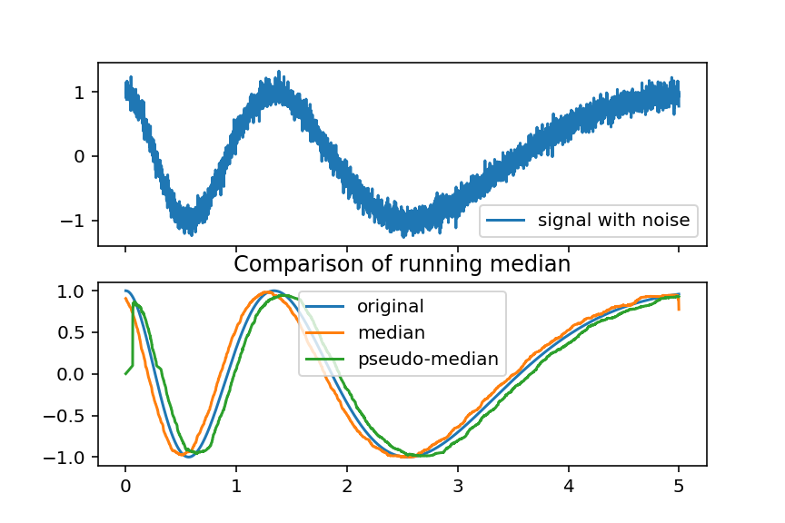
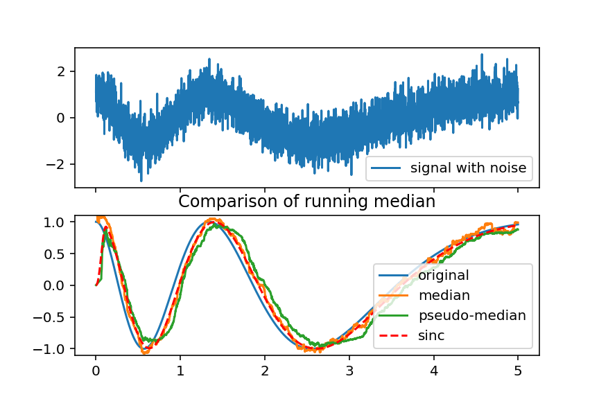
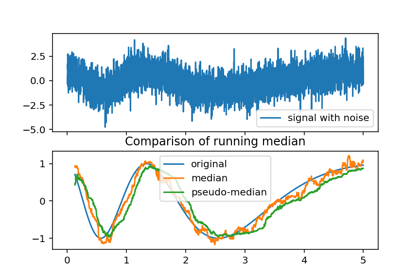
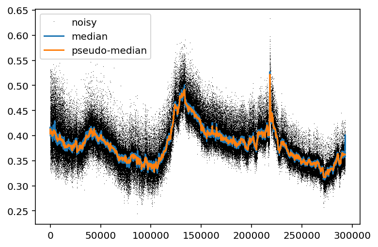
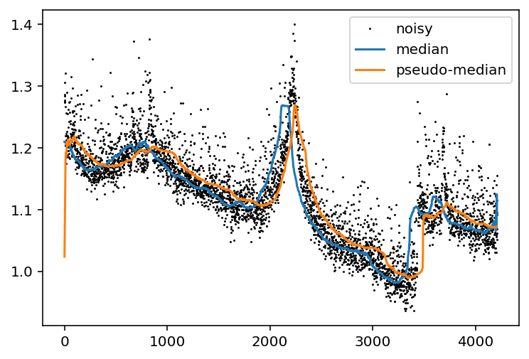

# pseudo-median
A pseudo running-median filter without the lag

A typical median filter, like an FIR filter, has a group delay of 1/2 the window length, which introduces a constant time lag.
This pseudo-median filter instead maintains a window of *sorted* values, adjusting the window bounds to accomodate the new value.
This reduces the processing time per point from O(N^2) to O(N) by starting with a nearly sorted list. More dramatically, it also 
causes the output to lead the input as the bounds of the noise seem to anticipate where the signal is going.

This lead time is not constant, however. It changes with the amplitude of the noise.
## Simulation
Here we have a moderate lead of 50ms when the the standard deviation of the noise is 1/10 the signal amplitude:

It's more like 100ms with the noise at 1/2 the signal amplitude:

And with the noise almost obscuring the signal, the lead is around 200ms, which is greater than the window length.

## Real data
Keeping the window length of 128, we have tried the filter on some real data at 1 sample per second. These would clearly benefit from a longer window, but notice the improved noise rejection of the pseudo-median filter.

Here's some data from the same source but decimated to 1 sample per minute. Both filters are producing smooth results, but notice the significant lag on the classic median filter, whereas the pseudo-median slightly leads the original.

